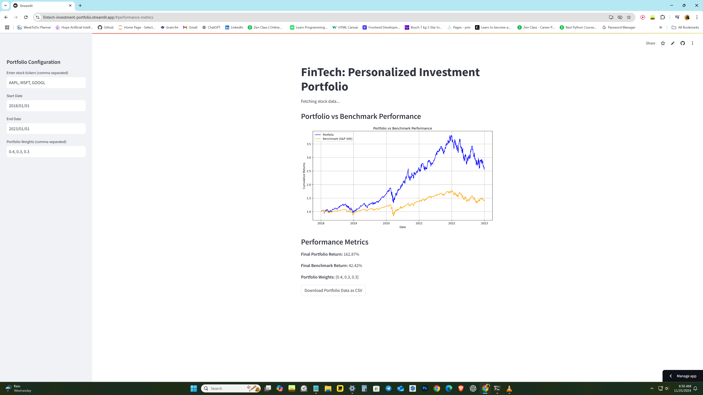

# FinTech: Personalized Investment Portfolio

This project is a personalized investment portfolio analysis tool created as part of the **FinTech Challenge 2024**. It helps users evaluate the performance of a custom stock portfolio compared to the S&P 500 benchmark.

## Features
- **Enter custom stock tickers and portfolio weights.**
- **Fetch real-time data from Yahoo Finance.**
- **Compare portfolio performance against the S&P 500.**
- **Download portfolio data as a CSV.**

## Demo
[Live Demo](https://fintech-investment-portfolio.streamlit.app)

## How to Run Locally
1. **Clone the repository:**
   ```bash
   git clone https://github.com/sriramarameshaidata/fintech-investment-portfolio.git
   cd fintech-investment-portfolio

## Use Cases

- **Personal Investment Planning:** Helps individuals plan and simulate potential investment strategies.
- **Comparing Portfolios:** Allows users to compare their custom portfolios against standard benchmarks like the S&P 500.
- **Investment Decision-Making:** Provides insights and analytics to aid in making informed investment decisions.

## Technologies Used

- **Streamlit:** An open-source app framework for turning data scripts into shareable web apps.
- **yfinance:** Provides methods for fetching historical market data from Yahoo Finance.
- **Matplotlib and pandas:** Used for creating static, interactive, and animated visualizations and data manipulation.

## Future Features

- **Allow Selection of Multiple Benchmarks:** Users can choose from benchmarks like NASDAQ, Dow Jones, etc.
- **Display Risk Metrics:** Show volatility, Sharpe ratio, and max drawdown to assess risks and returns.

## Improve Visual Appeal

- **Customize Plot:** Implement interactive features using `plotly`.
- **Experiment with Grid Styles:** Enhance readability with minor and major gridlines.

## Screenshots



## License

This project is licensed under the MIT License.

## Author

**Sriram A Ramesh**
- **Email:** sriramramesh.aidata@gmail.com
- **LinkedIn:** [iamsriramramesh](https://www.linkedin.com/in/iamsriramramesh/)
